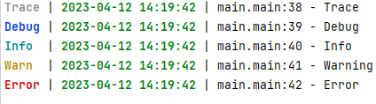

# glog

一个日志记录模块  
主要是简化使用

效果图：颜色可自定义


# 安装

```
go get -u github.com/Leviathangk/go-glog@latest
```

# 配置
注意：这里有两个级别，输出到控制台和输出到自定义是不同的级别，可以分开控制
```
type Config struct {
	Print       bool        // 是否进行打印：默认配置是是
	PrintLevel  int         // 打印级别：默认配置是 DebugLevel
	Out         []io.Writer // 输出日志的地方：可以用来自动保存日志
	OutPutLevel int         // AddOutPut 的级别：默认是 DebugLevel
	Formatter   *Formatter  // 输出格式化
}
```

# 使用

使用默认的 Logger  
注意：直接使用 glog.Debugln 也是默认的 logger

```
import ""github.com/Leviathangk/go-glog/glog""

func main() {
    // 方式 1
    glog.Debugln("xx")              // 默认的 logger
    
    // 方式 2
    logger := glog.DefaultLogger    // 默认的 logger
    logger.Traceln("xx")
    logger.Debugln("xx")
    logger.Infoln("xx")
    logger.Warningln("xx")
    logger.Errorln("xx")
    logger.Fatalln("xx")
    logger.Panicln("xx")
}
```
# logger 方法
## AddOutPut
给日志增加一个输出，受 OutPutLevel 限制  
注意：要实现 Writer 接口

```
file, _ := os.OpenFile("demo.log", os.O_CREATE|os.O_WRONLY|os.O_APPEND, 0666)
logger.AddOutPut(file)
```

## AddHook

利用 hook 实现分类处理  
需要实现的方法

```
type HookFunc func(level int, out string)
```

### 示例
假设现在的需求是只存 error 级别日志
```
// 新建文件
errFile, _ := os.OpenFile("err.log", os.O_CREATE|os.O_WRONLY|os.O_APPEND, 0666)

// 添加 Hook
logger.AddHook(func(level int, out string) {
    if level == glog.ErrorLevel {
        _, err := errFile.Write([]byte(out))
        if err != nil {
            return
        }
    }
})
```